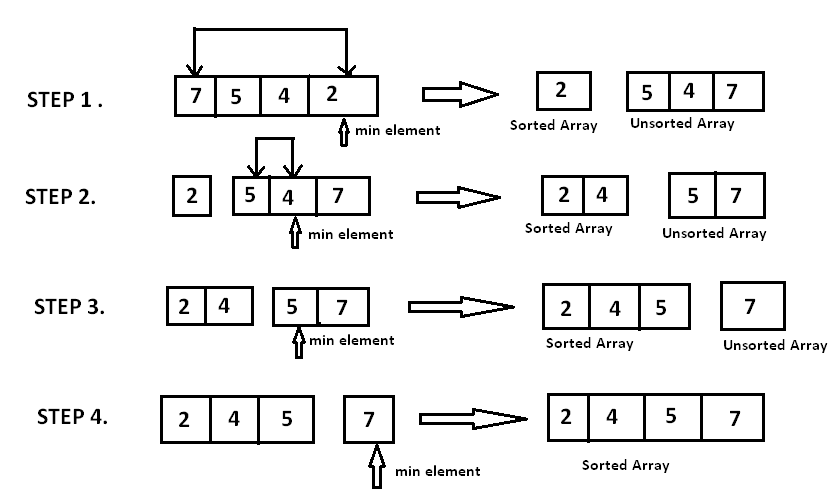

[](https://classroom.github.com/a/ke8zCzPd)
[](https://classroom.github.com/open-in-codespaces?assignment_repo_id=13511791)
# Práctica 4: Algoritmos de ordenamiento
Rodrigo Zamudio Tovar 2213026292

IDE: Embarcadero Dev C++ 6.3

Compilador: TDM-GCC 9.2.0 64-bit Profiling

# **Algoritmos de ordenamiento iterativos y recursivos**
Los algoritmos de ordenamiento son herramientas fundamentales en la ciencia de la computación y son esenciales para organizar datos de manera eficiente. Estos algoritmos son utilizados para reorganizar un conjunto de elementos, ya sea en forma ascendente o descendente, facilitando la búsqueda y recuperación eficiente de datos en una amplia variedad de aplicaciones. Cinco de los algoritmos más comúnmente utilizados son `Insertion Sort`, `Selection Sort`, `Bubblesort`, `Merge Sort` y `Quicksort`.

Los algoritmos de ordenamiento se pueden clasificar en dos categorías principales: **iterativos** y **recursivos**. Ambos enfoques buscan organizar un conjunto de datos, pero difieren en la forma en que abordan y resuelven el problema.

## Algoritmos de ordenamiento iterativos
Los algoritmos iterativos utilizan bucles y estructuras de control de flujo para realizar repeticiones y manipular los elementos de la lista hasta que se logra el ordenamiento deseado.

- Utilizan bucles y estructuras de control de flujo.
- Mantienen un control explícito sobre las iteraciones y la posición actual en la lista.
- Típicamente implementados de manera más directa y con un menor consumo de memoria.

### Insertion Sort 
Es un algoritmo simple que construye la lista ordenada un elemento a la vez. En cada iteración, toma un elemento de la lista no ordenada y lo coloca en la posición correcta en la lista ordenada.

Es eficiente para conjuntos de datos pequeños o parcialmente ordenados.


### Selection Sort
Divide la lista en dos partes: la parte ordenada y la parte no ordenada. En cada iteración, busca el elemento mínimo en la parte no ordenada y lo intercambia con el primer elemento no ordenado.

Es simple pero menos eficiente en comparación con otros algoritmos para conjuntos de datos grandes.



### Bubblesort
Compara y intercambia elementos adyacentes repetidamente hasta que la lista esté ordenada. En cada paso, los elementos más grandes "burbujean" hacia la posición correcta.

Simple y fácil de implementar, pero no eficiente para conjuntos de datos grandes.


## Algoritmos de ordenamiento recursivos
Los algoritmos recursivos dividen el problema en subproblemas más pequeños y resuelven cada subproblema de manera recursiva. Estos subresultados se combinan para obtener la solución final.

- Utilizan llamadas recursivas, dividiendo el problema en instancias más pequeñas del mismo problema.
- No mantienen un control explícito sobre la posición actual en la lista.
- Pueden requerir más memoria debido a las llamadas en la pila de ejecución.

### Merge Sort
Utiliza el enfoque de dividir y conquistar. Divide la lista en dos mitades, ordena cada mitad de manera recursiva y luego fusiona las dos mitades ordenadas para obtener la lista final ordenada.

Es eficiente para conjuntos de datos grandes, garantizando un rendimiento predecible.


### Quicksort
Quicksort selecciona un elemento como pivote, coloca los elementos más pequeños a la izquierda y los más grandes a la derecha. Luego, ordena recursivamente las dos sub-listas generadas.

Es rápido y eficiente para conjuntos de datos grandes, aunque su rendimiento puede variar según la elección del pivote.


## Objetivo de la práctica
Verificar de forma experimental el tiempo de ejecución de algunos algoritmos de ordenamiento.

# Implementación
## Archivos
Para verificar y comparar los tiempos de ejecución de los algoritmos, se necesitó de estos archivos:

- [ordenamiento_t.h](ordenamiento_t.h), que contiene la implementación de los algoritmos iterativos de ordenamiento insertion sort, selection sort y bubblesort.

- [ordenamiento_rec_t.h](ordenamiento_rec_t.h), que contiene la implementación de los algoritmos recursivos de ordenamiento merge sort y quicksort.

- [ordenamiento_t.cpp](ordenamiento_t.cpp), es el programa de control para ejecutar experimentos con los algoritmos iterativos de ordenamiento.

- [ordenamiento_rec_t.cpp](ordenamiento_rec_t.cpp), es el programa de control para ejecutar experimentos con los algoritmos recursivos de ordenamiento.

Además, se crearon dos archivos adicionales:

- [ordenamiento.h](ordenamiento.h) y [ordenamiento.cpp](ordenamiento.cpp), que se usaron para verificar de forma experimental el tiempo de ejecución de los cinco algoritmos incluidos en los dos archivos de cabecera [ordenamiento_rec_t.h](ordenamiento_rec_t.h) y [ordenamiento_t.h](ordenamiento_t.h).

# Procedimiento y resultados
Antes de proceder a verificar los resultados y comparar los tiempos de ejecución de los algoritmos, se creó el archivo [ordenamiento.h](ordenamiento.h), en el cual se implementó lo siguiente:

- a. Recibir por línea de comando el valor de n (tamaño del arreglo) y de m (número de arreglos a generar y ordenar).

- b. Para cada i  {1,2,...,m} hacer
    - Generar un arreglo Ai con n números enteros aleatorios entre 1 y 10n.
    - Para cada algoritmo en {insertion sort, selection sort, bubblesort, merge sort, quicksort} hacer
        - Crear una copia de Ai en Bi.
        - Ejecutar algoritmo para ordenar Bi
        - Registrar el tiempo t que tardó la ejecución de algoritmo para ordenar Bi.

Después, con [ordenamiento.cpp](ordenamiento.cpp) se probó la ejecución de todos los algoritmos y se mostraron los resultados.

Para comparar los cinco algoritmos, se ejecutó el programa de control varias veces, con diferentes tamaños *n* del arreglo y *m* número de arreglos a generar y ordenar. Desde n = 5 a n = 1,000,000,000. En la mayoría de las pruebas, m tuvo el valor de 30, ya que después de que n valiera 500,000, los tiempos de ejecución eran demasiado grandes, ya que en la mayoria de los casos, en el primer arreglo, cuando evaluaba el algoritmo de insertion sort, el tiempo podría llegar a ser mínimo de 5 minutos o más, mientras que en bubblesort, que fue el que más tiempo duró en evaluarse, podría tardar mínimo una hora en evaluar un solo arreglo.

Por lo tanto, la evaluación del tiempo de ejecución de los algoritmos, después de que n = 500,000 podría llegar a durar más de uno o dos dias enteros si m = 30.

## Resultados
- **Diferencias iniciales**
En tamaños pequeños de arreglo, la diferencia en el tiempo de ejecución entre algoritmos era mínima. Algoritmos como Insertion Sort, Selection Sort y Bubblesort mostraron resultados similares en conjuntos de datos pequeños.


- **Aumento de tamaño del arreglo**
A medida que el tamaño del arreglo aumentaba, se observó que los algoritmos iterativos (Insertion Sort, Selection Sort, Bubblesort) mostraban un aumento significativo en el tiempo de ejecución. Por el contrario, los algoritmos recursivos (Merge Sort, Quicksort) mantuvieron un rendimiento más constante y predecible a medida que aumentaba el tamaño del arreglo.


- **Impacto de Bubblesort**
Bubblesort fue el algoritmo que más se vio afectado por el tamaño del arreglo, mostrando tiempos de ejecución extremadamente largos a medida que n superaba los 100,000. Este comportamiento se atribuye a la naturaleza cuadrática de Bubblesort, que lo hace menos eficiente para conjuntos de datos grandes.


- **Desviación estándar**

La desviación estándar es una medida estadística que indica la dispersión de un conjunto de datos en torno a su media. En el contexto de los tiempos de ejecución de algoritmos, una baja desviación estándar sugiere que los tiempos son consistentes y tienden a agruparse alrededor de la media. Esta consistencia puede indicar que los algoritmos son robustos y predecibles en sus rendimientos, lo que facilita la comparación y evaluación. Por otro lado, una desviación estándar más alta podría señalar una mayor variabilidad en los tiempos de ejecución, lo que podría indicar una sensibilidad a condiciones específicas o la presencia de factores impredecibles.


- **Influencia de la recursividad**

Los algoritmos recursivos (Merge Sort, Quicksort) demostraron ser más eficientes en términos de tiempo de ejecución en comparación con los algoritmos iterativos a medida que n aumentaba. La estructura de división y conquista de los algoritmos recursivos permitió manejar conjuntos de datos más grandes de manera más efectiva.

- **Limitaciones y consideraciones**

La evaluación de algoritmos iterativos y recursivos reveló que los algoritmos recursivos tienden a ser más eficientes para conjuntos de datos grandes. La elección del algoritmo óptimo depende de factores como la naturaleza de los datos y los requisitos de rendimiento específicos de la aplicación. El rendimiento de Bubblesort fue notablemente inferior a los demás algoritmos en conjuntos de datos grandes.

*Es por eso que a partir de que el arreglo fuera de 1,000,000 en adelante, incluso si el programa se dejaba ejecutando por horas, incluso dias, era muy dificil no darse cuenta que los algoritmos iterativos no eran para nada eficientes.*


# Análisis
La elección del algoritmo de ordenamiento se vuelve crucial al enfrentar conjuntos de datos de diferentes tamaños y bajo distintas restricciones de eficiencia.

- **Comparación de algoritmos**

En la comparación detallada de los algoritmos de ordenamiento, los métodos iterativos, tales como **Insertion Sort, Selection Sort y Bubblesort**, exhibieron similitudes notables en conjuntos de datos pequeños, donde las diferencias de rendimiento eran mínimas. Estos algoritmos mostraron eficacia al tratar con conjuntos de datos más modestos, destacándose por su sencillez y facilidad de implementación. Sin embargo, a medida que el tamaño del conjunto de datos aumentaba, estos algoritmos iterativos revelaron su desventaja inherente en términos de tiempo de ejecución.

**Bubblesort**, en particular, se destacó negativamente debido a su complejidad cuadrática. Este algoritmo experimentó tiempos de ejecución significativamente más prolongados a medida que el tamaño del conjunto de datos superaba los 100,000. La naturaleza cuadrática de Bubblesort, que implica comparaciones y intercambios repetitivos, lo hizo menos eficiente para conjuntos de datos extensos, y se recomienda evitar su uso en estas situaciones.

Por otro lado, los algoritmos recursivos, como **Merge Sort** y **Quicksort**, presentaron un rendimiento más constante a medida que crecía el tamaño del conjunto de datos. Estos algoritmos, basados en el principio de división y conquista, demostraron ser más eficientes en términos de tiempo de ejecución para conjuntos de datos grandes. La capacidad de dividir el problema en subproblemas más pequeños y abordarlos de manera independiente permitió a los algoritmos recursivos gestionar eficazmente conjuntos de datos más extensos, superando a sus contrapartes iterativas en estos escenarios.

En términos prácticos, la elección entre algoritmos iterativos y recursivos dependerá de factores como el tamaño del conjunto de datos, la eficiencia en tiempo y la complejidad de espacio. Cada enfoque tiene sus ventajas y desventajas, y la decisión final se debe tomar considerando los requisitos específicos del problema y las limitaciones del entorno de implementación.

- **Consideraciones de memoria y gestión de la pila**

Aunque es cierto que los algoritmos recursivos demostraron ser más eficientes en cuanto al tiempo de ejecucción, no necesariamente quiere decir que en todos los casos conviene usarlos.

- Por ejemplo:

    - Para conjuntos de datos pequeños o medianos, donde la complejidad de espacio no es crítica, los algoritmos recursivos pueden ofrecer un rendimiento superior en tiempo de ejecución.
    - En situaciones donde la memoria es un recurso limitado o al trabajar con conjuntos de datos extremadamente grandes, los algoritmos iterativos pueden ser preferibles debido a su menor complejidad de espacio.

# Conclusión
En conclusión, la elección del algoritmo de ordenamiento debe basarse en una evaluación cuidadosa de las características específicas de la tarea y del conjunto de datos en cuestión. Los algoritmos iterativos como **Insertion Sort, Selection Sort y Bubblesort** son apropiados para *conjuntos de datos pequeños o medianos* donde su simplicidad y facilidad de implementación pueden ser beneficiosas. Sin embargo, muestran un rendimiento decreciente a medida que el tamaño del conjunto de datos aumenta, especialmente Bubblesort, que tiene una complejidad cuadrática.

Por otro lado, los algoritmos recursivos como **Merge Sort y Quicksort** ofrecen un rendimiento más constante y eficiente en términos de tiempo de ejecución a medida que los *conjuntos de datos crecen*. Aunque pueden presentar consideraciones adicionales en cuanto a complejidad de espacio y gestión de la pila, su capacidad para dividir y conquistar conjuntos de datos grandes los hace más adecuados para aplicaciones donde la eficiencia es crucial.

Es importante tener en cuenta que la elección entre algoritmos debe considerar no solo el tiempo de ejecución, sino también la complejidad de espacio, la estabilidad y los requisitos específicos de la aplicación. Además, la desviación estándar de los tiempos de ejecución puede proporcionar información valiosa sobre la consistencia y predictibilidad del rendimiento de los algoritmos en diferentes situaciones.

En la vida cotidiana, la elección del algoritmo de ordenamiento dependerá de la naturaleza de la tarea, el tamaño del conjunto de datos y las restricciones del entorno de implementación. La comprensión de las fortalezas y debilidades de cada algoritmo permitirá tomar decisiones informadas para optimizar el rendimiento y la eficiencia en una variedad de contextos.


# Puntaje extra: Merge Sort con Insertion sort
En [ordenamiento_rec_t.h](ordenamiento_rec_t.h) se implementó una variación del **Merge Sort**, la cual consiste en introducir una condición que verifica si el tamaño del subarreglo que se está ordenando es lo suficientemente pequeño. En lugar de seguir dividiendo y ordenando recursivamente subarreglos muy pequeños, se utiliza un algoritmo de ordenamiento más eficiente para conjuntos de datos pequeños, como el `insertion_sort`.

```cpp
void merge_sort_is(int A[], int inicio, int fin, int k) {
    if(inicio < fin){
        int medio = (inicio + fin) / 2;
        
        // Utiliza insertion_sort si el tamaño del subarreglo es menor o igual a k
        if(medio - inicio + 1 <= k){
            insertion_sort(A + inicio, medio - inicio + 1);
        } 
        else{
            merge_sort_is(A, inicio, medio, k);
        }

        if(fin - medio <= k) 
        {
            insertion_sort(A + medio + 1, fin - medio);
        } 
        else{
            merge_sort_is(A, medio + 1, fin, k);
        }
        merge(A, inicio, medio, fin);
    }
}
```
*NOTA: La implementación se probó en [ordenamiento_rec_t.cpp](ordenamiento_rec_t.cpp)*

La razón detrás de esta modificación radica en que, para conjuntos de datos pequeños, algoritmos de ordenamiento simples como `insertion_sort` pueden ser más eficientes que algoritmos más complejos de ordenamiento como `merge_sort`. Al identificar estos casos y cambiar a `insertion_sort` cuando sea apropiado, se busca mejorar el rendimiento general del algoritmo.

**Ejemplo:**


La versión modificada de `merge_sort`  con `insertion_sort` para arreglos pequeños puede ser más eficiente en términos de tiempo de ejecución en comparación con la versión original de `merge_sort`. Esto se debe a que `insertion_sort` tiene un rendimiento favorable en conjuntos de datos pequeños, aprovechando su complejidad cuadrática inferior. 

Sin embargo, la eficiencia de esta modificación dependerá del valor elegido para el umbral k. Un k adecuadamente ajustado puede mejorar el rendimiento al combinar las ventajas de ambos algoritmos, mientras que un valor inapropiado puede afectar negativamente el desempeño.

Esta estrategia se basa en la observación de que algoritmos de ordenamiento más simples pueden tener un rendimiento más rápido en conjuntos de datos pequeños debido a su menor complejidad. Sin embargo, en conjuntos de datos más grandes, donde algoritmos más complejos como `merge_sort` son más eficientes, se sigue utilizando la división y combinación recursiva para lograr una ordenación efectiva.